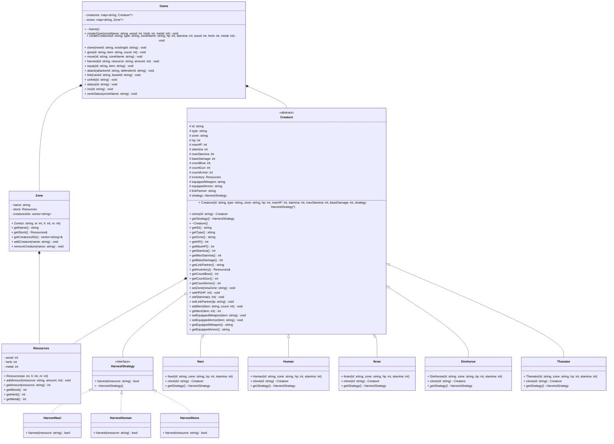

```mermaid
classDiagram
    class Resources {
        - wood: int
        - herb: int
        - metal: int
        + Resources(w: int, h: int, m: int)
        + addAmount(resource: string, amount: int) void
        + getAmount(resource: string) int
        + getWood() int
        + getHerb() int
        + getMetal() int
    }

    class Zone {
        - name: string
        - stock: Resources
        - creaturesIds: vector~string~
        + Zone(n: string, w: int, h: int, m: int)
        + getName() string
        + getStock() Resources&
        + getCreaturesIDs() vector~string~&
        + addCreature(name: string) void
        + removeCreature(name: string) void
    }

    class HarvestStrategy {
        <<interface>>
        + harvest(resource: string) bool
        + ~HarvestStrategy()
    }

    class HarvestNavi {
        + harvest(resource: string) bool
    }

    class HarvestHuman {
        + harvest(resource: string) bool
    }

    class HarvestNone {
        + harvest(resource: string) bool
    }

    class Creature {
        <<abstract>>
        # id: string
        # type: string
        # zone: string
        # hp: int
        # maxHP: int
        # stamina: int
        # maxStamina: int
        # baseDamage: int
        # countBow: int
        # countGun: int
        # countArmor: int
        # inventory: Resources
        # equippedWeapon: string
        # equippedArmor: string
        # linkPartner: string
        # strategy: HarvestStrategy*
        + Creature(id: string, type: string, zone: string, hp: int, maxHP: int, stamina: int, maxStamina: int, baseDamage: int, strategy: HarvestStrategy*)
        + clone(id: string) Creature*
        + getStrategy() HarvestStrategy*
        + ~Creature()
        + getID() string
        + getType() string
        + getZone() string
        + getHP() int
        + getMaxHP() int
        + getStamina() int
        + getMaxStamina() int
        + getBaseDamage() int
        + getLinkPartner() string
        + getInventory() Resources&
        + getCountBow() int
        + getCountGun() int
        + getCountArmor() int
        + setZone(newZone: string) void
        + setHP(HP: int) void
        + setStamina(s: int) void
        + setLinkPartner(lp: string) void
        + addItem(item: string, count: int) void
        + getItem(item: int) int
        + setEquippedWeapon(item: string) void
        + setEquippedArmor(item: string) void
        + getEquippedWeapon() string
        + getEquippedArmor() string
    }

    class Navi {
        + Navi(id: string, zone: string, hp: int, stamina: int)
        + clone(id: string) Creature*
        + getStrategy() HarvestStrategy*
    }

    class Human {
        + Human(id: string, zone: string, hp: int, stamina: int)
        + clone(id: string) Creature*
        + getStrategy() HarvestStrategy*
    }

    class Ikran {
        + Ikran(id: string, zone: string, hp: int, stamina: int)
        + clone(id: string) Creature*
        + getStrategy() HarvestStrategy*
    }

    class Direhorse {
        + Direhorse(id: string, zone: string, hp: int, stamina: int)
        + clone(id: string) Creature*
        + getStrategy() HarvestStrategy*
    }

    class Thanator {
        + Thanator(id: string, zone: string, hp: int, stamina: int)
        + clone(id: string) Creature*
        + getStrategy() HarvestStrategy*
    }

    class Game {
        - creatures: map~string, Creature*~
        - zones: map~string, Zone*~
        + ~Game()
        + createZone(zoneName: string, wood: int, herb: int, metal: int) void
        + createCreature(id: string, type: string, zoneName: string, hp: int, stamina: int, wood: int, herb: int, metal: int) void
        + clone(newId: string, existingId: string) void
        + give(id: string, item: string, count: int) void
        + move(id: string, zoneName: string) void
        + harvest(id: string, resource: string, amount: int) void
        + equip(id: string, item: string) void
        + attack(attackerId: string, defenderId: string) void
        + link(naviId: string, beastId: string) void
        + unlink(id: string) void
        + status(id: string) void
        + inv(id: string) void
        + zoneStatus(zoneName: string) void
    }

    %% Наследование интерфейса (Strategy Pattern)
    HarvestStrategy <|.. HarvestNavi
    HarvestStrategy <|.. HarvestHuman
    HarvestStrategy <|.. HarvestNone

    %% Наследование существ (Prototype Pattern)
    Creature <|-- Navi
    Creature <|-- Human
    Creature <|-- Ikran
    Creature <|-- Direhorse
    Creature <|-- Thanator

    %% Композиция (Composition)
    Zone *-- Resources
    Creature *-- Resources
    Game *-- Zone
    Game *-- Creature

    %% Агрегация (Aggregation)
    Creature o-- HarvestStrategy
```
