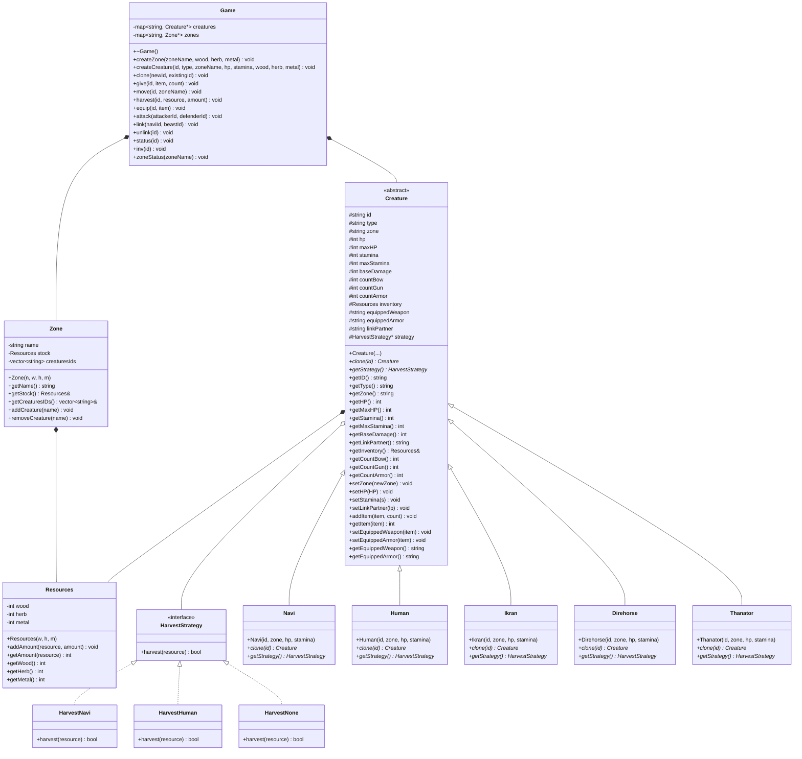

```mermaid
classDiagram
    class Resources {
        -int wood
        -int herb
        -int metal
        +Resources(w, h, m)
        +addAmount(resource, amount) void
        +getAmount(resource) int
        +getWood() int
        +getHerb() int
        +getMetal() int
    }

    class Zone {
        -string name
        -Resources stock
        -vector~string~ creaturesIds
        +Zone(n, w, h, m)
        +getName() string
        +getStock() Resources&
        +getCreaturesIDs() vector~string~&
        +addCreature(name) void
        +removeCreature(name) void
    }

    class HarvestStrategy {
        <<interface>>
        +harvest(resource) bool
    }

    class HarvestNavi {
        +harvest(resource) bool
    }

    class HarvestHuman {
        +harvest(resource) bool
    }

    class HarvestNone {
        +harvest(resource) bool
    }

    class Creature {
        <<abstract>>
        #string id
        #string type
        #string zone
        #int hp
        #int maxHP
        #int stamina
        #int maxStamina
        #int baseDamage
        #int countBow
        #int countGun
        #int countArmor
        #Resources inventory
        #string equippedWeapon
        #string equippedArmor
        #string linkPartner
        #HarvestStrategy* strategy
        +Creature(...)
        +clone(id) Creature*
        +getStrategy() HarvestStrategy*
        +getID() string
        +getType() string
        +getZone() string
        +getHP() int
        +getMaxHP() int
        +getStamina() int
        +getMaxStamina() int
        +getBaseDamage() int
        +getLinkPartner() string
        +getInventory() Resources&
        +getCountBow() int
        +getCountGun() int
        +getCountArmor() int
        +setZone(newZone) void
        +setHP(HP) void
        +setStamina(s) void
        +setLinkPartner(lp) void
        +addItem(item, count) void
        +getItem(item) int
        +setEquippedWeapon(item) void
        +setEquippedArmor(item) void
        +getEquippedWeapon() string
        +getEquippedArmor() string
    }

    class Navi {
        +Navi(id, zone, hp, stamina)
        +clone(id) Creature*
        +getStrategy() HarvestStrategy*
    }

    class Human {
        +Human(id, zone, hp, stamina)
        +clone(id) Creature*
        +getStrategy() HarvestStrategy*
    }

    class Ikran {
        +Ikran(id, zone, hp, stamina)
        +clone(id) Creature*
        +getStrategy() HarvestStrategy*
    }

    class Direhorse {
        +Direhorse(id, zone, hp, stamina)
        +clone(id) Creature*
        +getStrategy() HarvestStrategy*
    }

    class Thanator {
        +Thanator(id, zone, hp, stamina)
        +clone(id) Creature*
        +getStrategy() HarvestStrategy*
    }

    class Game {
        -map~string, Creature*~ creatures
        -map~string, Zone*~ zones
        +~Game()
        +createZone(zoneName, wood, herb, metal) void
        +createCreature(id, type, zoneName, hp, stamina, wood, herb, metal) void
        +clone(newId, existingId) void
        +give(id, item, count) void
        +move(id, zoneName) void
        +harvest(id, resource, amount) void
        +equip(id, item) void
        +attack(attackerId, defenderId) void
        +link(naviId, beastId) void
        +unlink(id) void
        +status(id) void
        +inv(id) void
        +zoneStatus(zoneName) void
    }

    %% Наследование интерфейса (Strategy Pattern)
    HarvestStrategy <|.. HarvestNavi
    HarvestStrategy <|.. HarvestHuman
    HarvestStrategy <|.. HarvestNone

    %% Наследование существ (Prototype Pattern)
    Creature <|-- Navi
    Creature <|-- Human
    Creature <|-- Ikran
    Creature <|-- Direhorse
    Creature <|-- Thanator

    %% Композиция (Composition)
    Zone *-- Resources
    Creature *-- Resources
    Game *-- Zone
    Game *-- Creature

    %% Агрегация (Aggregation)
    Creature o-- HarvestStrategy
```
